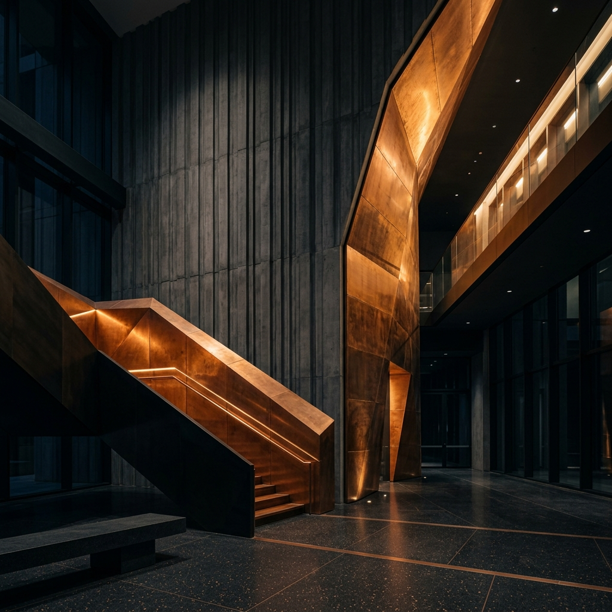
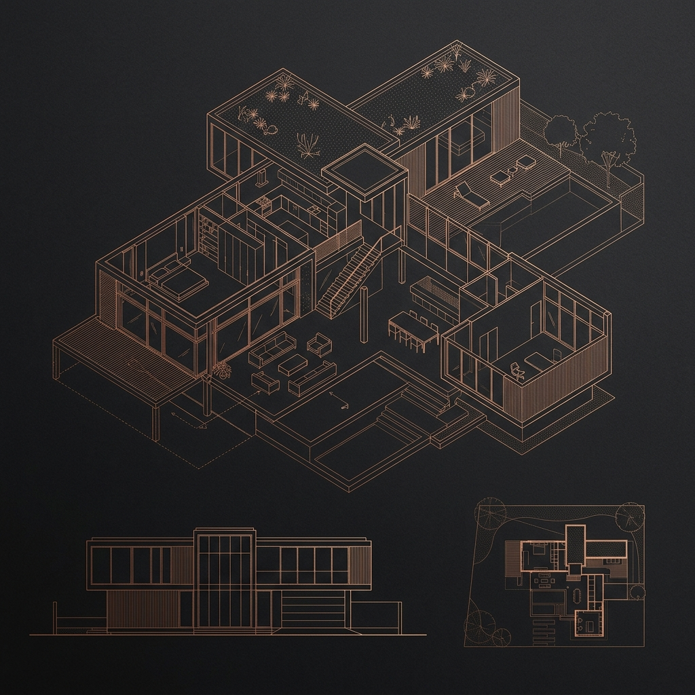
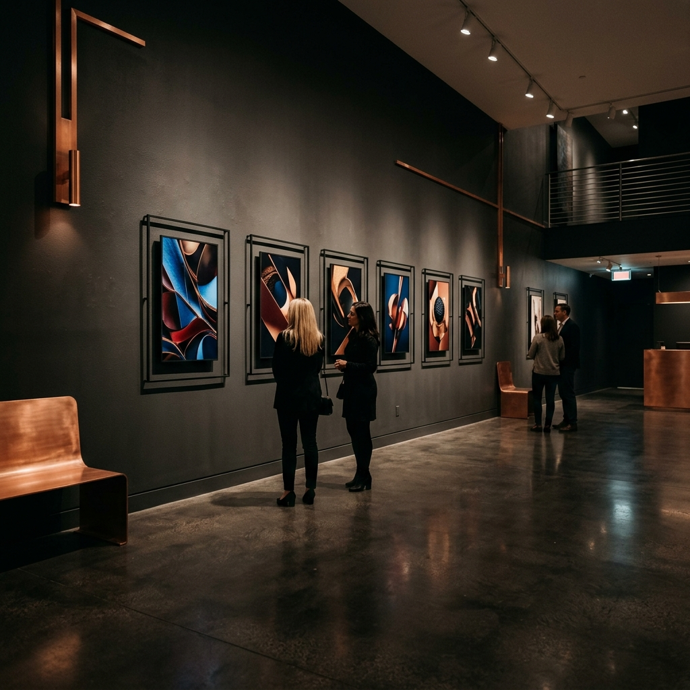
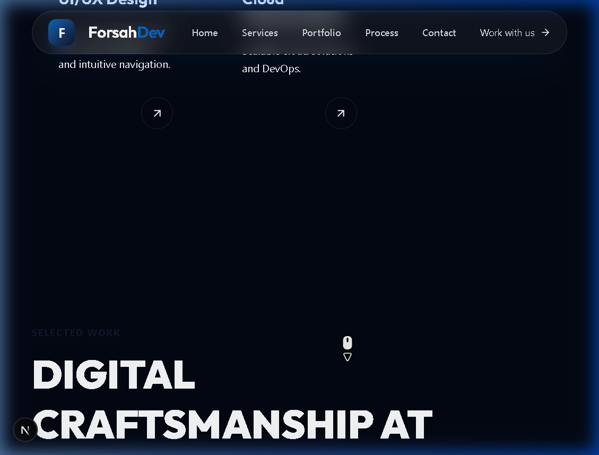

# 🏛️ Forsah Dev Agency — The Architecture of Technical Mastery

**Forsah Dev Agency** is a premium digital engineering studio dedicated to the pursuit of technical perfection. We harmonize mathematical precision with human intuition to craft software that defines the new standard of digital excellence.

## 🏺 The 2026 Redesign: "Neo-Humanist Sophistication"
The platform has been completely reimagined to move beyond the sterile, automated aesthetic of the past, embracing a "Human-Authored" premium look:

- **Sophisticated Charcoal & Copper Palette**: A grounding base of `#080808` Charcoal accented by `#C2996B` Brushed Copper. No neons. No glows. Just pure, high-contrast elegance.
- **Tactile Brutalism**: Shifting from soft glassmorphism to crisp 1px geometry, zero-softness shadows, and subtle film-grain textures.
- **Neo-Humanist Typography**: Pairing the expressive **Cormorant Garamond** (Serif) for headings with the functional **Instrument Sans** (Sans-Serif) for precise communication.
- **Asymmetric Editorial Layout**: Inspired by high-end magazine compositions, moving away from generic grids to intentional whitespace and structured balance.
- **Artisanal Visuals**: Custom-generated architectural photography that emphasizes structure and light.

## 🕯️ Core Philosophy
- **Precision as a Standard**: Every line of code and every pixel serves a specific, logical purpose.
- **Technical Integrity**: We prioritize performance, security, and scalability over fleeting design trends.
- **Human Connection**: Interfaces designed to be emotionally resonant and intellectually satisfying.

## 🖼️ Visual Experience (Updated 2026)

### 1. The Entry Point


### 2. Core Competencies


### 3. Proof of Superiority


### 4. Methodological Precision


## 🏗️ Technical Specifications
- **Core Engine**: Next.js 16+ (App Router Architecture)
- **Styling Engine**: Tailwind CSS 4.0 (Custom Token System)
- **Motion Engine**: Framer Motion 12 (Low-latency Transitions)
- **Typefaces**: Cormorant Garamond & Instrument Sans
- **Asset Logic**: Generative Architectural Visuals

## ⚙️ Engineering Setup
1. **Initialize**:
   ```bash
   git clone https://github.com/Maamoun0/forsah-dev-agency.git
   cd forsah-dev-agency
   npm install
   ```
2. **Execute**:
   ```bash
   npm run dev
   ```
3. **Inspect**: [localhost:3000](http://localhost:3000)

---
Engineered with surgical precision by **Antigravity** for **Forsah Dev Agency**.
