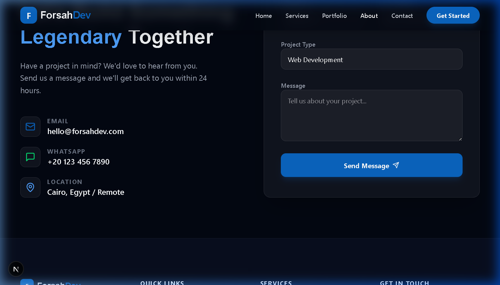

# 🚀 Forsah Dev Agency — Smart Software Solutions

**Forsah Dev Agency** (شركة فرصة) is a premium software development agency specializing in AI-driven solutions, custom web applications, and digital transformation. We combine cutting-edge technology with strategic design to help businesses grow.

## ✨ Features

- **Modern UI/UX**: Sleek, responsive design built with Next.js and Tailwind CSS.
- **AI Integration**: Focused on delivering intelligent software that automates and optimizes business processes.
- **Comprehensive Portfolio**: Showcasing success stories in AI, FinTech, and Sustainability.
- **Dynamic Animations**: Enhanced user experience using Framer Motion.
- **Service Oriented**: Clear presentation of core services including Custom Development, Cloud Solutions, and AI Strategy.

## 📸 Screenshots

### 1. Hero Section

### 2. Our Services

### 3. Portfolio

### 4. Our Process

### 5. Contact Us

## 🛠️ Technology Stack

- **Framework**: Next.js 15+ (App Router).
- **Styling**: Tailwind CSS 4.0, Vanilla CSS.
- **Animations**: Framer Motion.
- **Icons**: Lucide React.
- **Languages**: TypeScript, JavaScript, HTML, CSS.

## 📖 How to Run

1. Clone the repository.
2. Install dependencies: `npm install`.
3. Run the development server: `npm run dev`.
4. Open `http://localhost:3000` in your browser.

---
Created with ❤️ by Maamoun's AI Assistant for **Forsah Dev Agency**.
